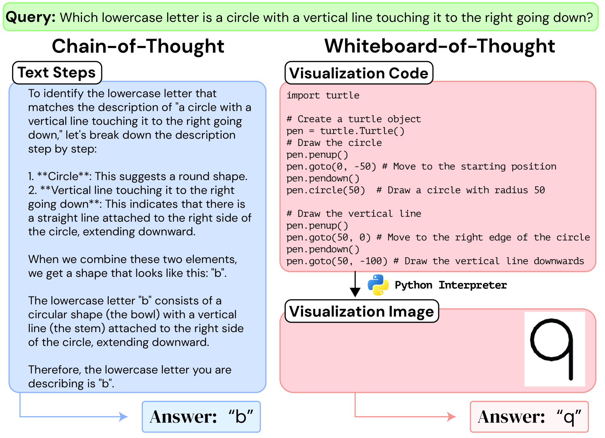
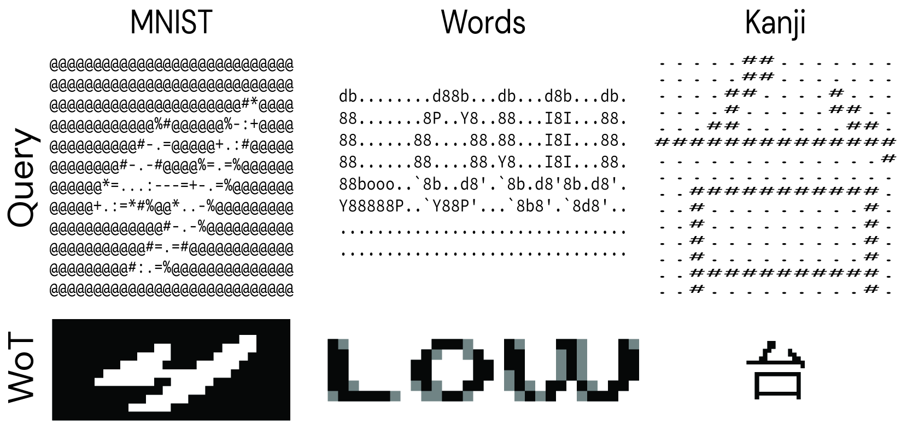
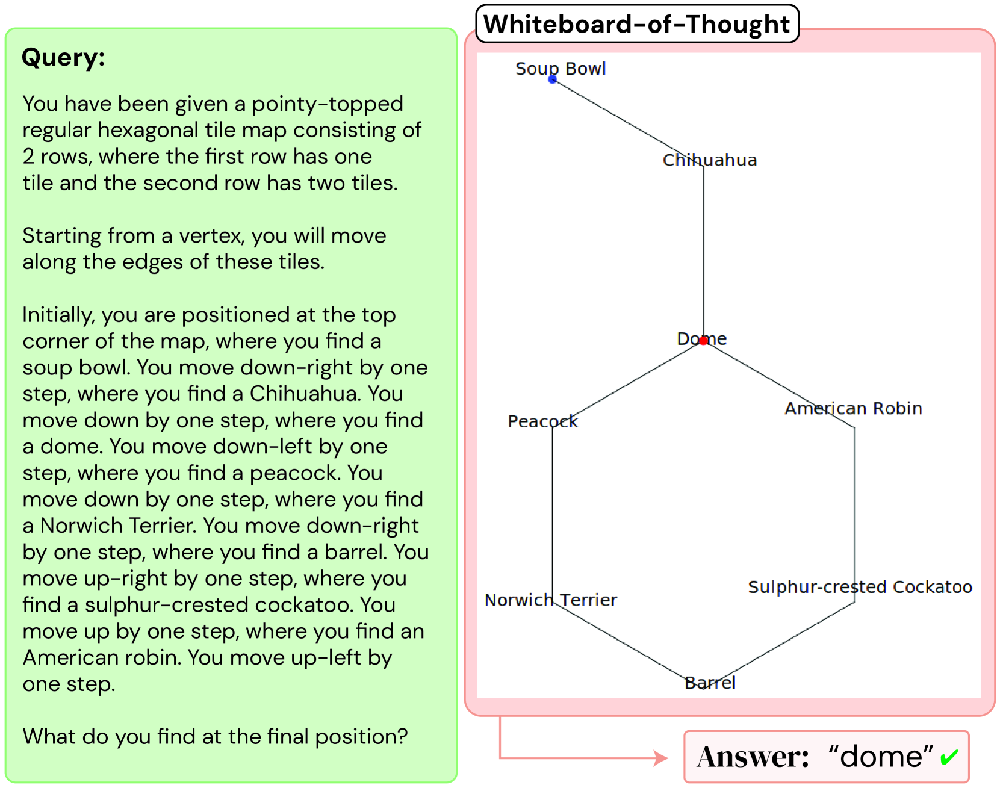
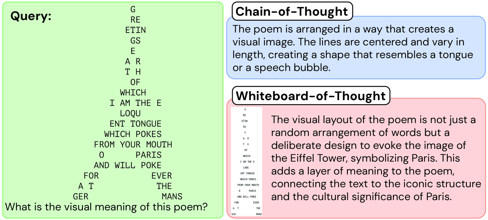
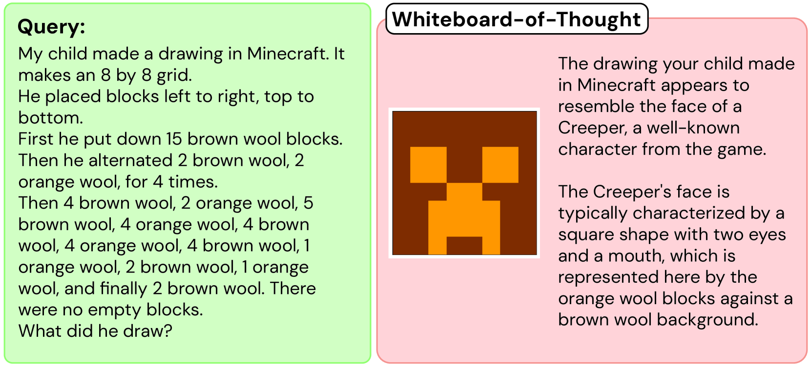

# Whiteboard-of-Thought: 
## Thinking Step-by-Step Across Modalities
Sachit Menon, Richard Zemel, Carl Vondrick (2024)

---

## 概要

- 視覚的思考を要するタスクにおいて、マルチモーダル大規模言語モデル（MLLMs）の能力を解放するための手法「Whiteboard-of-Thought（WoT）」を提案。
- コードを生成して画像を作成し、その画像をモデルに戻してさらなる推論を実行(MatplotlibやTurtleを使用)。
- 視覚的および空間的推論が必要なタスクでCoTを上回る成果を示す。

---

## クイズ

Which lowercase letter is a circle with a vertical line touching it to the right going down?

---

---

## 背景と動機

- 人間は、問題解決時に言語と視覚の推論を織り交ぜて利用。
- LLMsは算術や記号的推論では成功しているが、視覚的推論には課題が残る。
- 提案手法WoTは、比喩的な「ホワイトボード」を使用して視覚化を行い、視覚的推論能力を解放。

---

## 手法

### Whiteboard-of-Thoughtの流れ
1. **クエリ**をモデルに入力。
2. モデルが**視覚化を生成するコード**を生成。
3. コードを実行して**画像を作成**。
4. 生成された画像をモデルに戻してさらなる推論。

---

## 実験

### タスク1: アスキーアートの理解
- **BIG-Benchデータセット**（例：MNIST数字認識、単語認識、漢字認識）を使用。

---

- 人間にとってはテキストも画像も同じモダリティだが、LLMにとっては異なるモダリティ。

| Task         | Direct (%) | CoT (%) | WoT (%) |
|--------------|------------|---------|----------------|
| **MNIST**    | 19.6       | 21.6    | 66.0           |
| **Word**     | 24.8       | 27.2    | 66.4           |
| **Kanji**    | 1.1        | 1.1     | 73.8           |
- CoTでは性能が不十分だが、WoTは視覚化により大幅な性能向上を達成。

---

### タスク2: 空間ナビゲーション
- 異なる空間構造（円形、六角形、正方形など）でのナビゲーション指示を評価。

---
| Structure         | Circle (%) | Hexagon (%) | Triangle (%) | Square (%) | Rhombus (%) | Overall Avg (%) |
|-------------------|------------|-------------|--------------|------------|--------------|-----------------|
| **Direct**        | 14         | 3           | 16           | 68         | 63           | 33              |
| **CoT**           | 25         | 8           | 26           | 98         | 51           | 42              |
| **WoT**    | 41         | 61          | 55           | 50         | 52           | 52              |
- グリッドはテキストで表現しやすいことに加えてデータが多いので従来手法でも高性能。
- WoTはグリッド以外の形状でも一貫した性能を発揮。

---

## 実際の使用例
### カリグラム
- 文字の配置が詩の意味に寄与する

---

### ゲーム内のアート作品
- プレイヤーの生成したコンテンツが適切かどうか行動ログから判断

---

## 実装してみた
https://github.com/HKodai/WoT

---

## まとめ
- 視覚的および空間的推論が必要なタスクにおいて、WoTはCoTを上回る成果を示す。
- モデルのコード生成能力、視覚入力の理解能力、一般的な推論能力が向上するにつれて、WoTの結果も同様に向上すると期待される。

---
## 参考文献
Whiteboard-of-Thought: Thinking Step-by-Step Across Modalities
(https://whiteboard.cs.columbia.edu/)